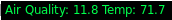

# PurpleAir


This program pulls air quality and temperature data from the [sensor IDs](https://www.purpleair.com/map) you pass in (pipe delimited) and then takes a average of them and then outputs a little json for i3blocks.

*Note: this Key will work but you really should just grab a new one it's easy on the map click "Get this widget" click "data" and your new one is in the url*




```conf
[weather]
command=PurpleAir --ids "35307|40309|59131" --key HSG4ZV5HDT15GQD1
format=json
interval=500

```
